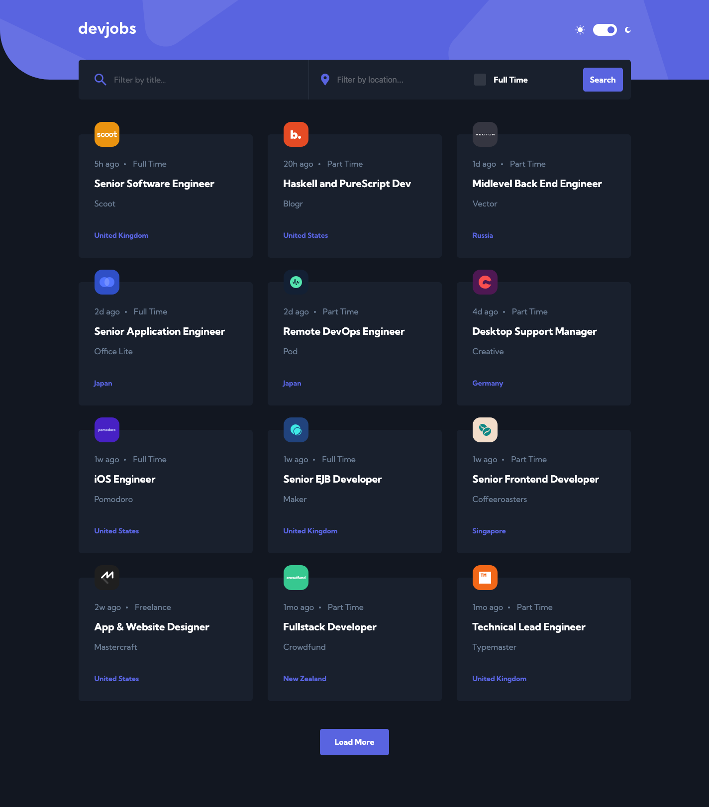

# Frontend Mentor - Devjobs web app solution

This is a solution to the [Devjobs web app challenge on Frontend Mentor](https://www.frontendmentor.io/challenges/devjobs-web-app-HuvC_LP4l). Frontend Mentor challenges help you improve your coding skills by building realistic projects.

## About the Project

The "Devjobs Web App" is a challenge from Frontend Mentor aimed at creating a job listing platform for developers.

This project was built using Next.js 14 Pages Router, focusing on static site generation for deployment on GitHub Pages.

It combines React for component-based development and Scss for styling, offering a dark/light theme toggle for user preference.

Users can browse through a list of job offer cards, filter them by job title, location, and whether they are full-time positions. Each job listing has its own statically generated page, providing detailed information about the job offer.

## Preview and Links

<b>Preview</b>

 

 

| [Frontend Mentor](https://www.frontendmentor.io/solutions/devjobs-web-app-JUzOCZKDux) | [Live Demo URL](https://ionstici.github.io/devjobs-web-app) |
| ------------------------------------------------------------------------------------- | ----------------------------------------------------------- |

## Features

- **Dark/Light Theme:** Users can switch between dark and light themes for a personalized browsing experience.
- **Job Listings:** A list of job offer cards, each representing a unique job opportunity.
- **Filtering:** Ability to filter jobs by title, location, and employment type (full-time or not).
- **Static Generation:** Each job listing has a dedicated, statically generated page for SEO benefits and fast load times.
- **Responsive Design:** Styled with Scss to ensure the app is usable on various devices.

## Built with

- **`Next.js` 14 Pages Router:** For routing and static site generation.
- **`React`:** To create the interactive UI components.
- **`Scss`:** For modular styling of the application.

## Deployment

This project is deployed on **GitHub Pages** as a statically generated site, leveraging Next.js's export feature for static HTML generation.

## Acknowledgements

Thanks to **Frontend Mentor** for providing this challenge, which allowed me to practice with Next.js 14 Pages Router and static site generation techniques.
